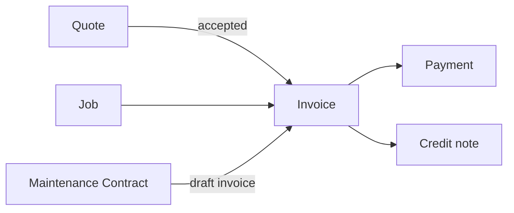

**Billing** is where your firm prices work, bills for it, and keeps track of what customers still owe. You will find it in the left sidebar under **Finance → Billing**.

## The four documents

Everything in Billing is one of four things. They are listed together, newest first, in a single list called the **ledger**.

| Document | What it is | Effect on the account |
| --- | --- | --- |
| **Quote** | A price you offer a <Tooltip tip="The company or owner responsible for a building. They receive the paperwork for work done on their lifts, sign off completed visits, and are billed for them." cta="Building Manager" href="/start/glossary">building manager</Tooltip> before the work is agreed | None until you invoice |
| **Invoice** | The bill for work done | Adds to what the customer owes |
| **Payment** | Money received against an invoice | Reduces what the customer owes |
| **Credit note** | An adjustment, refund or write-off | Reduces what the customer owes |

The usual sequence is **quote → invoice → payment**, but none of the steps are compulsory. You can invoice without quoting, and a [maintenance contract](/admin/maintenance-contracts/overview) can produce a draft invoice for you with no quote in sight.

<Note>
  Billing is for the office. Owners and admins have identical access to all of it. A team member whose only role is Technician does not get the Billing area — following a billing link lands them on Jobs instead. They can still raise a quote, from the quote builder on an **Issue** page or a **building manager** page; everything else about a quote is out of reach from the web app. See [Billing reference](/admin/billing/reference#who-can-do-what).
</Note>

## What do you want to do?

<CardGroup cols={2}>
  <Card title="Quote for work" icon="file-lines" href="/admin/billing/quotes">
    Price a job before it is agreed, send the quotation, and record what the customer decided.
  </Card>

  <Card title="Raise and issue an invoice" icon="file-invoice" href="/admin/billing/invoices">
    Write a draft, check it, and issue it so it counts as money owed.
  </Card>

  <Card title="Email a quote or invoice" icon="envelope" href="/admin/billing/emailing-documents">
    Attach the PDF to an email and send it to the building manager's contact address.
  </Card>

  <Card title="Record a payment" icon="hand-holding-dollar" href="/admin/billing/payments">
    Log money you have received and settle it against the right invoice.
  </Card>

  <Card title="Credit, refund or write off" icon="rotate-left" href="/admin/billing/credit-notes">
    Reverse part or all of an invoice you have already issued.
  </Card>

  <Card title="Chase what you are owed" icon="clock" href="/admin/billing/statements">
    See which accounts are late, and send a customer a statement of their account.
  </Card>

  <Card title="Set up standard items" icon="list-check" href="/admin/billing/standard-items">
    Keep your callout fee and hourly rate in one place instead of retyping them.
  </Card>

  <Card title="Number your own documents" icon="hashtag" href="/admin/billing/reference-numbers">
    Choose the prefix and format for your quote, invoice and credit-note numbers.
  </Card>

  <Card title="Accept online payments" icon="credit-card" href="/admin/billing/online-payments">
    Let building managers pay an invoice by card or PayNow from their app.
  </Card>

  <Card title="Look something up" icon="book" href="/admin/billing/reference">
    Every status, filter, figure and permission in Billing, in one table.
  </Card>
</CardGroup>

## Finding a document

The **Ledger** tab is the way in. Every issued document is a row; clicking a row opens it in an overlay so you never lose your place in the list.

Three controls narrow it:

- **Type** — All, Quotes, Invoices, Payments or Credit notes. Each carries a count. A deposit taken against a quote is labelled **Deposit** on its row but is a payment underneath, so **Payments** (and **All**) returns it.
- **Show archived** — off by default. It affects quotes: only a draft or rejected invoice can be archived, and the ledger never shows drafts or rejected invoices, so an archived invoice does not appear on the ledger either way.
- **Customer** — pick one building manager, or leave it on **All customers**.

<Tip>
  Drafts are deliberately absent from the ledger. A draft is unfinished paperwork, not a transaction — you will find it in your [Inbox](/admin/inbox) until it is sent or issued.
</Tip>

## The four figures at the top

A band of four totals sits above the ledger. Every one of them is computed over the rows currently loaded, for the customer you have filtered to — not over the whole account.

| Figure | What it counts |
| --- | --- |
| **Open pipeline** | Quotes sent and still waiting on a decision |
| **Outstanding** | Money owed on issued invoices, with the number that are overdue |
| **Collected · 30d** | Payments that settled in the last 30 days |
| **Credit outstanding** | Credit notes raised but not yet applied to an invoice |

Exact definitions are in [Billing reference](/admin/billing/reference#the-figures-above-the-ledger).

<Warning>
  The ledger is not a complete financial history. It loads at most 500 documents of each type, and the four figures above it describe only what is loaded. For the full history of one customer's account, read their [statement of account](/admin/billing/statements), which covers the whole active set.
</Warning>

## Before you start billing

Two settings are worth getting right once, before you send anything to a customer:

1. **[Your document numbers](/admin/billing/reference-numbers)** — quotes, invoices and credit notes each take a number from a series you control. Set the shape before you issue your first document.
2. **[Your standard items](/admin/billing/standard-items)** — the callout fee, the hourly rate, the disposal charge. Priced once, picked onto every document after.
