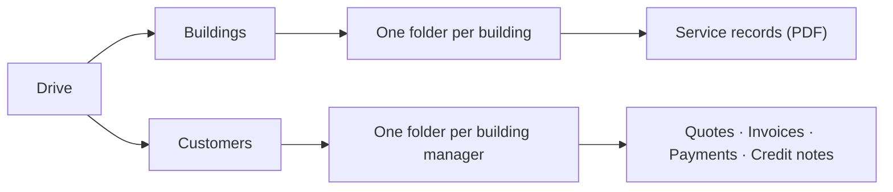

Drive is your document store. Everything LiftAuth produces — service <Tooltip tip="The report produced when a technician fills in a form and submits it — the item results, photos, notes and signatures." cta="Glossary" href="/start/glossary">records</Tooltip>, quotes, invoices, payments and credit notes — is filed here automatically, so you never have to keep a separate folder of PDFs.

You do not create anything in Drive. It is a place to **find, read and download**
documents that already exist.

## How the folders are organised

Drive has exactly two levels, and two kinds of folder.

* **Building folders** hold the service records for one building.
* **Customer folders** hold the account documents for one
  [building manager](/admin/building-managers) — their quotes, invoices, payments
  and credit notes.

A building folder appears on its own, without you adding it, as soon as either of
these is true:

* your firm has a lift registered in that building, or
* your firm holds a service record for that building.

Lifts that are not attached to any building are collected in a single folder
called **Unassigned**, which always sorts to the bottom of the list.

Customer folders work the same way: every building manager on your account gets a
folder, whether or not there is anything in it yet.

<Note>
  Drive replaced the old flat Records list — the sidebar no longer has a Records item, and old record links land here. For what a record contains and how signing works, see [Records](/admin/records); for raising and sending the commercial documents, see [Billing](/admin/billing/overview).
</Note>

## What do you want to do?

<CardGroup cols={2}>
  <Card title="Find a record" icon="magnifying-glass" href="/admin/drive/finding-files">
    Open the right building folder and narrow the list down to the visit you want.
  </Card>

  <Card title="Download records" icon="download" href="/admin/drive/downloading-files">
    Save one PDF, a few you have ticked, or a whole building folder as a zip.
  </Card>

  <Card title="Get a record signed" icon="signature" href="/admin/drive/sending-for-sign-off">
    Send the sign-off request to the building manager, or share a signing link
    yourself.
  </Card>

  <Card title="Find a customer's paperwork" icon="file-invoice" href="/admin/drive/customer-documents">
    Every quote, invoice, payment and credit note for one building manager, in one
    place.
  </Card>
</CardGroup>

## Getting started

<Steps>
  <Step title="Open Drive">
    Click **Drive** in the left sidebar, under **Operations**.
  </Step>

  <Step title="Search, or pick a folder">
    The search box at the top filters both sections at once — type a building name
    or a customer name and only the matching folders stay on screen.
  </Step>

  <Step title="Open the folder">
    A building folder opens a list of that building's records. A customer folder
    opens their account documents, split across four tabs.
  </Step>
</Steps>

Full detail on every column, badge and button is in the
[Drive reference](/admin/drive/reference).
