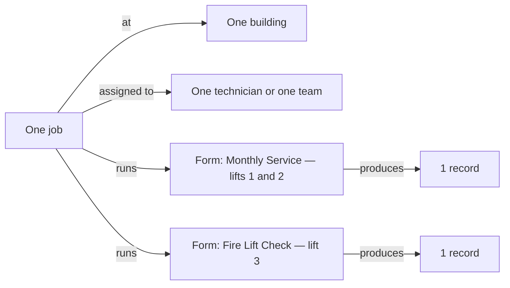

A <Tooltip tip="One visit's worth of work at one building, which can cover several lifts." cta="job" href="/start/glossary">job</Tooltip> is one visit to one building. Every time a technician goes on-site, a job records it — and when the job is closed, what the technician wrote becomes the permanent history of those lifts.

This page explains how a job is put together and how it moves. If you just want
to do something, see [Schedule a job](/admin/jobs/how-to-schedule-a-job) or
[Close a job](/admin/jobs/how-to-close-a-job).

## What a job is made of

A job is not "one lift and one job type." It is a container:

* **One building.** Every lift on the job is in the same building.
* **One or more lifts.** A visit that services four lifts in one tower is one job, not four.
* **One or more coverage groups.** A <Tooltip tip="One record template paired with the lifts it covers." cta="coverage group" href="/start/glossary">coverage group</Tooltip> pairs a <Tooltip tip="The everyday word for a record template once it is attached to a job — the thing a technician actually fills in." cta="form" href="/start/glossary">form</Tooltip> (a record template) with the lifts that form covers. The dialogs label these "Records" on screen, but the group is the instruction, not the report: one form covering three lifts produces one record when it is submitted; a form that only covers one lift produces one record per lift.
* **Exactly one assignee** — one technician, or one team. Never both, never two people.
* **One or more time windows.** A visit too long for a working day is split across consecutive days, and stays a single job.

<Note>
  Older parts of LiftAuth talk about a job having a **type** — maintenance,
  breakdown, or repair. That is no longer true of the job itself. The *forms*
  carry the type. A single job can run a maintenance form and a breakdown form in
  the same visit, and the technician's app shows no job-type label because there
  is none.
</Note>

## The six statuses

<Steps>
  <Step title="Open">
    The job exists, but nobody is assigned and no time is set. Most jobs skip straight past this — the **Schedule Job** button creates and schedules in one action, and converting a quote also schedules in the same operation.

    An Open job does not appear on the Jobs board or in the list view. It is reachable only from its building's maintenance contract page, or by its direct job link.
  </Step>

  <Step title="Scheduled">
    A technician or a team is assigned, and the date and time window are set. The
    job now appears in the technician's app.

    Scheduling is what sends the notifications — nothing goes out when a job is merely created. Every user of the building manager's firm gets a push and an email; it is firm-wide, not a single named contact. The assigned technician, or every member of the assigned team, gets a separate push. Whoever did the scheduling is not notified. Rescheduling goes through the same path, so the same firm-wide push and email go out again, still worded as "scheduled".
  </Step>

  <Step title="Work Done">
    The technician has finished on-site and submitted the work. The <Tooltip tip="The report produced when a technician fills in a form and submits it — the item results, photos, notes and signatures." cta="records" href="/start/glossary">records</Tooltip> exist, each signed by the technician who did that lift. The job is now waiting for the building side to sign off.
  </Step>

  <Step title="Signed">
    Sign-off is complete. Either the building manager signed — on the technician's
    phone, or through their own signing link — or the technician explicitly
    skipped signing. The job is waiting for the office.
  </Step>

  <Step title="Closed">
    An admin has reviewed and closed it. Linked issues are closed, and any record that got here without a real signature has its PDF generated now — the signed ones already had theirs from signing. Closing a job raises a draft invoice only when the job belongs to an active maintenance contract billed per job, or — with no contract — was created by converting a quote. Contracts billed annually are invoiced on their own schedule instead, and a contract set to bill nothing never drafts. This is the end of the line.
  </Step>
</Steps>

The sixth status is **Cancelled**. A job can be cancelled from any of the four
statuses above **Closed** — including after it has been signed, for the rare case
where the office needs to void a visit. Cancelling asks for a reason and cannot be undone.

Cancelling destroys nothing. Any records the crew had already submitted stay exactly where they were, fully visible in each lift's record history; cancelling writes the status and the reason on the job and touches nothing else.

**Closed** and **Cancelled** are the only end states, and nothing moves out of
them. Nothing moves backwards either: there is no way to push a **Signed** job
back to **Work Done**.

## Who moves it

| Move | Who does it | Where |
| --- | --- | --- |
| Open → Scheduled | Admin, owner, or a maintenance contract | Dashboard |
| Scheduled → Scheduled (reschedule) | Admin or owner; a technician only on their own job | Dashboard or team calendar |
| Scheduled → Work Done | Technician | Mobile app |
| Work Done → Signed | Building manager signing, or the technician skipping signing | Phone, signing link, or app |
| Signed → Closed | Admin or owner | Dashboard |
| Anything → Cancelled | Admin, owner, or technician | Dashboard — the technician app has no cancel action |

Technicians do sign in to the web dashboard and do get the Jobs page, so a technician-role user cancels a job there. There is no cancel action anywhere in the technician mobile app.

<Warning>
  Cancellation currently applies no ownership check: any owner, admin or technician in your workspace can cancel any job that has not already been closed or cancelled, including one assigned to somebody else. This is a known bug, not a feature — do not build a way of working on it.
</Warning>

Nobody in the office can sign on the building manager's behalf. There is no sign
button in the dashboard, on purpose.

## Where jobs come from

<CardGroup cols={2}>
  <Card title="A maintenance contract" icon="calendar-check" href="/admin/maintenance-contracts/overview">
    The plan generates and schedules its visits on its own cadence. You do nothing.
  </Card>

  <Card title="An admin scheduling one" icon="calendar-plus" href="/admin/jobs/how-to-schedule-a-job">
    For a breakdown call-out, a repair, or any one-off visit.
  </Card>

  <Card title="A technician on-site" icon="mobile-screen" href="/technician/create-a-job">
    An unplanned visit, logged from the phone as it happens.
  </Card>

  <Card title="A converted quote" icon="file-invoice" href="/admin/billing/quotes">
    Arrives already **Scheduled**, with its required parts listed. Converting asks for exactly one technician or team and a scheduled window, and schedules the job in the same operation.
  </Card>
</CardGroup>

## Two things that trip people up

**A crew can split a big visit between them.** On a multi-lift job, each
technician uploads their lifts as they finish. The job stays **Scheduled** until
every lift is in and somebody taps **Submit job**.

If two of them recorded the same lift, that lift becomes **contested** and the job cannot be submitted until it is settled. Every upload is kept until a crew member picks the one that counts, in the technician app at submit time; the versions not picked are then **permanently deleted along with their photos**, with no archive and no undo. Any issues those discarded versions logged do survive. The choosing is only possible while the job is still **Scheduled** — once it is submitted, nothing can be re-adjudicated. The admin web app shows the rival versions on the job page but cannot resolve them, so the office can see a contested lift and must ask the crew to settle it.

**Signing can be skipped.** If the building manager is not around and will not
sign remotely, the technician can confirm **Skip signing**. The job still reaches
**Signed**, but the record's PDF carries no building-manager sign-off, and
LiftAuth stores which technician skipped and when.
