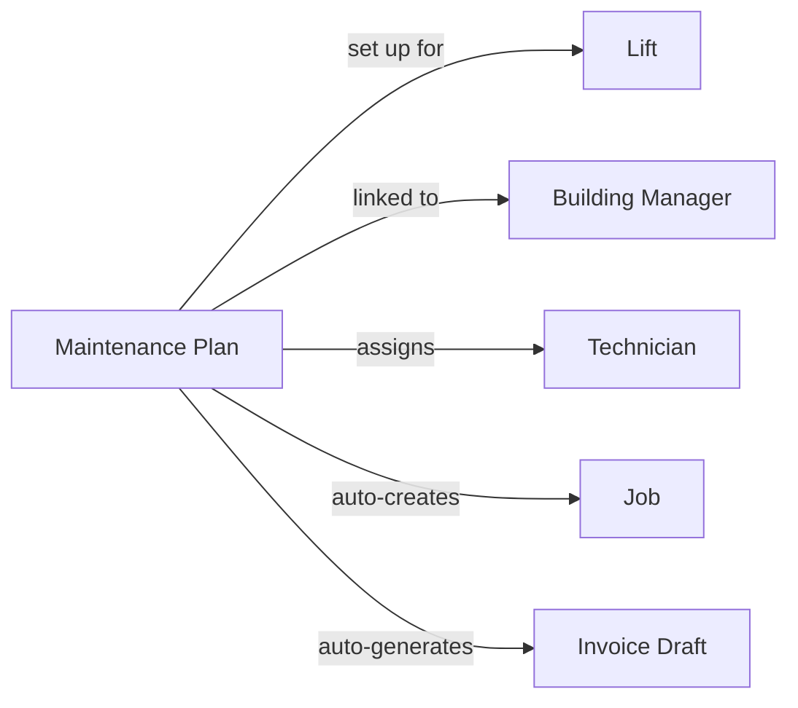

यह पेज LiftAuth के मुख्य बिल्डिंग ब्लॉक्स और वे कैसे जुड़ते हैं, इसकी व्याख्या करता है। किसी भी अन्य चीज़ से पहले इसे पढ़ें।

---

## आपका संगठन

आपका संगठन **भवन प्रबंधकों** के साथ काम करता है और **लिफ्टों** का रखरखाव करता है। एक भवन प्रबंधक उस भवन के लिए ज़िम्मेदार होता है जिसमें एक लिफ्ट स्थापित है।

---

## जॉब क्या है?

एक जॉब किसी लिफ्ट पर एक एकल सर्विस विज़िट का प्रतिनिधित्व करती है। हर बार जब एक तकनीशियन ऑन-साइट जाता है, तो उस विज़िट के लिए एक जॉब मौजूद होनी चाहिए।

जॉब्स के तीन प्रकार होते हैं:

| प्रकार | कब उपयोग करें |
| --- | --- |
| **Maintenance** | एक नियोजित, नियमित निरीक्षण — मासिक, त्रैमासिक, आदि। |
| **Breakdown** | एक आपातकालीन कॉल-आउट जब लिफ्ट काम करना बंद कर देती है या असुरक्षित होती है। |
| **Repair** | पहले रिपोर्ट की गई किसी विशिष्ट खराबी को ठीक करने की यात्रा। |

---

## जॉब कैसे बनाई जाती है?

जॉब्स दो तरीकों से बनाई जा सकती हैं:

- **मैन्युअल रूप से** — एक एडमिन डैशबोर्ड से एक जॉब बनाता है, इसे एक तकनीशियन को सौंपता है, और एक तारीख और समय निर्धारित करता है।
- **स्वचालित रूप से** — यदि एक लिफ्ट में [रखरखाव प्लान](/start/concepts#maintenance-plans) है, तो जॉब्स बिना किसी मैन्युअल इनपुट के एक आवर्ती शेड्यूल पर बनाई जाती हैं।

---

## जॉब का जीवनचक्र

प्रत्येक जॉब निम्नलिखित चरणों से गुजरती है:

<Steps>
  <Step title="Open">
    जॉब मौजूद है लेकिन अभी तक शेड्यूल या असाइन नहीं की गई है।
  </Step>
  <Step title="Scheduled">
    एक तकनीशियन और एक तारीख/समय विंडो असाइन की गई है। तकनीशियन इसे अपने मोबाइल ऐप में देख सकता है।
  </Step>
  <Step title="Work Done">
    तकनीशियन ने ऑन-साइट काम पूरा कर लिया है और अपनी चेकलिस्ट या रिपोर्ट सबमिट कर दी है। एक रिकॉर्ड स्वचालित रूप से बनाया जाता है। भवन प्रबंधक को ईमेल और SMS द्वारा हस्ताक्षर अनुरोध प्राप्त होता है।
  </Step>
  <Step title="Signed">
    भवन प्रबंधक ने [रिकॉर्ड](/start/concepts#records) पर हस्ताक्षर कर दिए हैं। जॉब एक एडमिन द्वारा समीक्षा और बंद करने के लिए तैयार है।
  </Step>
  <Step title="Closed">
    एडमिन ने जॉब की समीक्षा करके उसे बंद कर दिया है। यदि कोई [रखरखाव प्लान](/start/concepts#maintenance-plans) सक्रिय है, तो एक इनवॉइस ड्राफ्ट स्वचालित रूप से जनरेट किया जाता है।
  </Step>
</Steps>

---

## रिकॉर्ड्स {#records}

एक रिकॉर्ड जॉब के दौरान क्या हुआ इसकी लिखित रिपोर्ट है। यह स्वचालित रूप से तब बनाया जाता है जब तकनीशियन अपना काम सबमिट करता है। इसमें शामिल हैं:

- चेकलिस्ट परिणाम (प्रत्येक आइटम के लिए पास/फेल)
- तकनीशियन द्वारा जोड़े गए कोई भी नोट्स
- ऑन-साइट संलग्न फ़ोटो
- तकनीशियन का हस्ताक्षर
- भवन प्रबंधक का हस्ताक्षर

रिकॉर्ड स्थायी होते हैं — उन्हें हस्ताक्षर के बाद संपादित नहीं किया जा सकता।

---

## मुद्दे

मुद्दे लिफ्ट पर पाई गई खराबियाँ हैं। उन्हें एक जॉब के दौरान एक तकनीशियन द्वारा रिपोर्ट किया जा सकता है, या एक एडमिन द्वारा लॉग किया जा सकता है। किसी मुद्दे को संबोधित करने के लिए एक मरम्मत जॉब उठाई जा सकती है। जब तकनीशियन इसे ठीक के रूप में चिह्नित करता है, तो मुद्दा स्वचालित रूप से बंद हो जाता है।

एक मरम्मत जॉब एक या अधिक मुद्दों से जुड़ी हो सकती है। जब तकनीशियन एक मुद्दे को ठीक के रूप में चिह्नित करता है, तो यह स्वचालित रूप से बंद हो जाता है।

---

## इनवॉइस

कार्य पूरा होने के बाद भवन प्रबंधक को इनवॉइस भेजे जाते हैं। यदि कोई [रखरखाव प्लान](/start/concepts#maintenance-plans) सक्रिय है, तो प्रत्येक चक्र के अंत में एक इनवॉइस ड्राफ्ट स्वचालित रूप से जनरेट किया जाता है। ड्राफ्ट के वास्तविक इनवॉइस बनने से पहले एक एडमिन को इसे अनुमोदित करना होगा।

---

## रखरखाव प्लान {#maintenance-plans}

एक रखरखाव प्लान सब कुछ एक साथ बांधती है। एक बार सेट अप होने के बाद, यह स्वचालित रूप से एक आवर्ती शेड्यूल पर जॉब्स बनाती है और प्रत्येक चक्र के अंत में इनवॉइस ड्राफ्ट जनरेट करती है — बिना किसी एडमिन से मैन्युअल इनपुट के।

