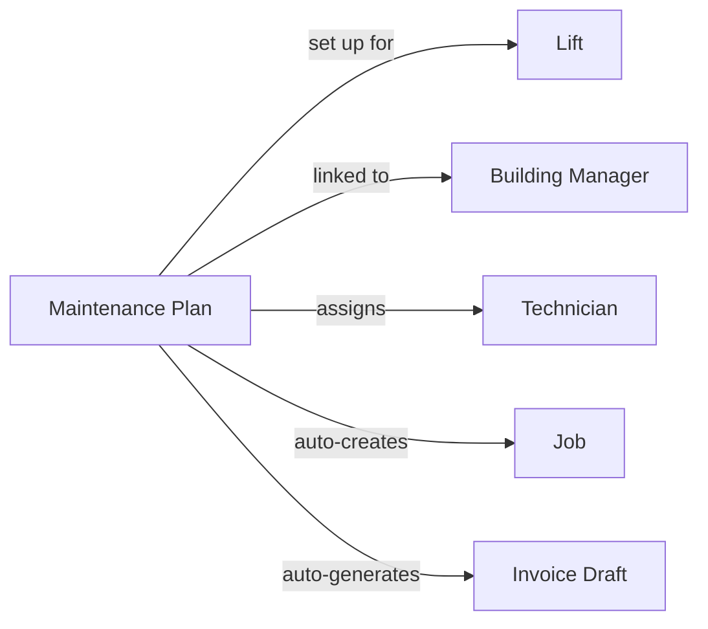

यह पृष्ठ LiftAuth के मुख्य बिल्डिंग ब्लॉक्स और वे कैसे जुड़ते हैं, इसकी व्याख्या करता है। किसी और चीज़ से पहले इसे पढ़ें।

---

## आपका संगठन

आपका संगठन **Building Managers** के साथ काम करता है और **Lifts** का रखरखाव करता है। एक Building Manager उस बिल्डिंग के लिए ज़िम्मेदार होता है जिसमें लिफ्ट लगी है।

---

## जॉब क्या है?

एक जॉब किसी लिफ्ट पर एकल सर्विस विज़िट का प्रतिनिधित्व करता है। हर बार जब कोई तकनीशियन ऑन-साइट जाता है, तो उस विज़िट के लिए एक जॉब मौजूद होना चाहिए।

जॉब के तीन प्रकार हैं:

| प्रकार | कब उपयोग करें |
| --- | --- |
| **Maintenance** | एक नियोजित, नियमित निरीक्षण — मासिक, त्रैमासिक आदि। |
| **Breakdown** | एक आपातकालीन कॉल-आउट जब लिफ्ट काम करना बंद कर दे या असुरक्षित हो। |
| **Repair** | किसी विशिष्ट, पहले से रिपोर्ट की गई खराबी को ठीक करने के लिए एक विज़िट। |

---

## जॉब कैसे बनाया जाता है?

जॉब दो तरीकों से बनाए जा सकते हैं:

- **Manually** — एक Admin डैशबोर्ड से जॉब बनाता है, उसे एक तकनीशियन को असाइन करता है, और दिनांक व समय निर्धारित करता है।
- **Automatically** — यदि किसी लिफ्ट का [Maintenance Plan](/start/concepts#maintenance-plans) है, तो जॉब बिना किसी मैन्युअल इनपुट के आवर्ती शेड्यूल पर बनाए जाते हैं।

---

## जॉब का जीवनचक्र

प्रत्येक जॉब निम्नलिखित चरणों से गुज़रता है:

<Steps>
  <Step title="Open">
    जॉब मौजूद है लेकिन अभी तक शेड्यूल या असाइन नहीं किया गया है।
  </Step>
  <Step title="Scheduled">
    एक तकनीशियन और दिनांक/समय विंडो असाइन की गई है। तकनीशियन इसे अपने मोबाइल ऐप में देख सकता है।
  </Step>
  <Step title="Work Done">
    तकनीशियन ने ऑन-साइट काम पूरा कर लिया है और अपनी चेकलिस्ट या रिपोर्ट सबमिट कर दी है। एक रिकॉर्ड स्वचालित रूप से बनाया जाता है। Building Manager को ईमेल और SMS द्वारा हस्ताक्षर अनुरोध प्राप्त होता है।
  </Step>
  <Step title="Signed">
    Building Manager ने [Record](/start/concepts#records) पर हस्ताक्षर कर दिए हैं। जॉब Admin द्वारा समीक्षा और बंद करने के लिए तैयार है।
  </Step>
  <Step title="Closed">
    Admin ने जॉब की समीक्षा की और बंद कर दिया। यदि [Maintenance Plan](/start/concepts#maintenance-plans) सक्रिय है, तो एक इनवॉइस ड्राफ्ट स्वचालित रूप से जनरेट हो जाता है।
  </Step>
</Steps>

---

## Records {#records}

एक रिकॉर्ड जॉब के दौरान जो हुआ उसकी लिखित रिपोर्ट है। यह तब स्वचालित रूप से बनाया जाता है जब तकनीशियन अपना काम सबमिट करता है। इसमें शामिल है:

- चेकलिस्ट परिणाम (प्रत्येक आइटम के लिए पास/फेल)
- तकनीशियन द्वारा जोड़े गए कोई भी नोट
- ऑन-साइट संलग्न फ़ोटो
- तकनीशियन के हस्ताक्षर
- Building Manager के हस्ताक्षर

रिकॉर्ड स्थायी हैं — हस्ताक्षर के बाद उन्हें संपादित नहीं किया जा सकता।

---

## Issues

Issues लिफ्ट पर पाई गई खराबियां हैं। उन्हें जॉब के दौरान एक तकनीशियन द्वारा रिपोर्ट किया जा सकता है, या एक Admin द्वारा लॉग किया जा सकता है। एक issue को संबोधित करने के लिए एक repair जॉब उठाया जा सकता है। जब तकनीशियन इसे ठीक के रूप में चिह्नित करता है, तो issue स्वचालित रूप से बंद हो जाता है।

एक Repair जॉब को एक या अधिक issues से लिंक किया जा सकता है। जब तकनीशियन किसी issue को ठीक के रूप में चिह्नित करता है, तो वह स्वचालित रूप से बंद हो जाता है।

---

## Invoices

काम पूरा होने के बाद Building Manager को इनवॉइस भेजे जाते हैं। यदि [Maintenance Plan](/start/concepts#maintenance-plans) सक्रिय है, तो प्रत्येक चक्र के अंत में एक इनवॉइस ड्राफ्ट स्वचालित रूप से जनरेट होता है। वास्तविक इनवॉइस बनने से पहले एक Admin को ड्राफ्ट को स्वीकृत करना होगा।

---

## Maintenance Plans {#maintenance-plans}

एक Maintenance Plan सब कुछ एक साथ बांधता है। एक बार सेट हो जाने के बाद, यह स्वचालित रूप से आवर्ती शेड्यूल पर जॉब बनाता है और प्रत्येक चक्र के अंत में इनवॉइस ड्राफ्ट जनरेट करता है — Admin से किसी मैन्युअल इनपुट के बिना।

