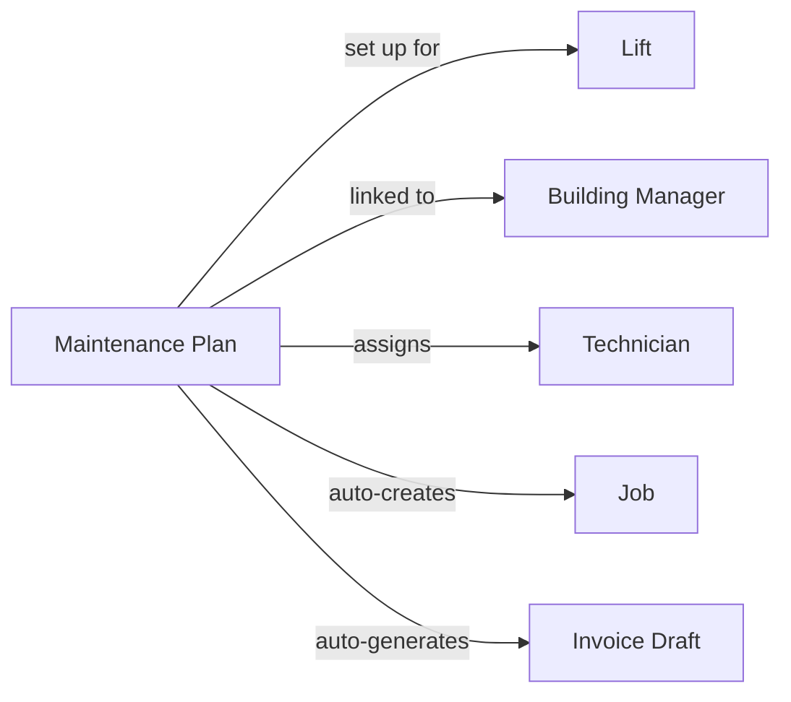

यह पेज LiftAuth के मुख्य बिल्डिंग ब्लॉक्स और वे कैसे जुड़ते हैं, समझाता है। किसी भी अन्य चीज़ से पहले इसे पढ़ें।

---

## आपका संगठन

आपका संगठन **Building Managers** के साथ काम करता है और **Lifts** का रखरखाव करता है। एक Building Manager उस भवन के लिए ज़िम्मेदार होता है जिसमें लिफ्ट स्थापित है।

---

## जॉब क्या है?

एक जॉब एक लिफ्ट पर एक सर्विस विज़िट का प्रतिनिधित्व करता है। हर बार जब कोई तकनीशियन साइट पर जाता है, उस विज़िट के लिए एक जॉब मौजूद होना चाहिए।

जॉब्स तीन प्रकार के होते हैं:

| प्रकार | कब उपयोग करें |
| --- | --- |
| **Maintenance** | एक नियोजित, नियमित निरीक्षण — मासिक, त्रैमासिक, आदि। |
| **Breakdown** | एक आपातकालीन कॉल-आउट जब लिफ्ट काम करना बंद कर देती है या असुरक्षित होती है। |
| **Repair** | किसी विशिष्ट, पहले से रिपोर्ट किए गए दोष को ठीक करने के लिए एक विज़िट। |

---

## जॉब कैसे बनाया जाता है?

जॉब्स दो तरीकों से बनाए जा सकते हैं:

- **मैन्युअल रूप से** — एक Admin डैशबोर्ड से एक जॉब बनाता है, उसे एक तकनीशियन को सौंपता है, और एक तारीख और समय सेट करता है।
- **स्वचालित रूप से** — यदि किसी लिफ्ट में [Maintenance Plan](/hi/start/concepts#maintenance-plans) है, तो जॉब्स बिना किसी मैन्युअल इनपुट के एक आवर्ती शेड्यूल पर बनाए जाते हैं।

---

## जॉब का जीवनचक्र

प्रत्येक जॉब निम्नलिखित चरणों से होकर गुज़रता है:

<Steps>
  <Step title="Open">
    जॉब मौजूद है लेकिन अभी तक शेड्यूल या असाइन नहीं किया गया है।
  </Step>
  <Step title="Scheduled">
    एक तकनीशियन और एक तारीख/समय विंडो असाइन की गई है। तकनीशियन इसे अपने मोबाइल ऐप में देख सकता है।
  </Step>
  <Step title="Work Done">
    तकनीशियन ने ऑन-साइट काम पूरा कर लिया है और अपनी चेकलिस्ट या रिपोर्ट सबमिट कर दी है। एक रिकॉर्ड स्वचालित रूप से बनाया जाता है। Building Manager को ईमेल और SMS द्वारा एक हस्ताक्षर अनुरोध प्राप्त होता है।
  </Step>
  <Step title="Signed">
    Building Manager ने [Record](/hi/start/concepts#records) पर हस्ताक्षर कर दिए हैं। जॉब को एक Admin द्वारा समीक्षा और बंद किए जाने के लिए तैयार है।
  </Step>
  <Step title="Closed">
    Admin ने जॉब की समीक्षा कर ली है और उसे बंद कर दिया है। यदि कोई [Maintenance Plan](/hi/start/concepts#maintenance-plans) सक्रिय है, तो एक चालान ड्राफ्ट स्वचालित रूप से उत्पन्न होता है।
  </Step>
</Steps>

---

## Records {#records}

एक record एक जॉब के दौरान क्या हुआ इसकी लिखित रिपोर्ट है। यह तब स्वचालित रूप से बनाया जाता है जब तकनीशियन अपना काम सबमिट करता है। इसमें शामिल है:

- चेकलिस्ट परिणाम (प्रत्येक आइटम के लिए पास/फेल)
- तकनीशियन द्वारा जोड़ी गई कोई भी टिप्पणियाँ
- ऑन-साइट संलग्न तस्वीरें
- तकनीशियन का हस्ताक्षर
- Building Manager का हस्ताक्षर

Records स्थायी होते हैं — हस्ताक्षर के बाद उन्हें संपादित नहीं किया जा सकता।

---

## Issues

Issues वे दोष होते हैं जो किसी लिफ्ट पर पाए जाते हैं। उन्हें किसी जॉब के दौरान एक तकनीशियन द्वारा रिपोर्ट किया जा सकता है, या एक Admin द्वारा लॉग किया जा सकता है। किसी issue को संबोधित करने के लिए एक repair जॉब उठाया जा सकता है। जब तकनीशियन इसे ठीक के रूप में चिह्नित करता है, तो issue स्वचालित रूप से बंद हो जाता है।

एक Repair जॉब को एक या अधिक issues से लिंक किया जा सकता है। जब तकनीशियन एक issue को ठीक के रूप में चिह्नित करता है, तो यह स्वचालित रूप से बंद हो जाता है।

---

## Invoices

काम पूरा होने के बाद Building Manager को Invoices भेजे जाते हैं। यदि कोई [Maintenance Plan](/hi/start/concepts#maintenance-plans) सक्रिय है, तो प्रत्येक चक्र के अंत में एक चालान ड्राफ्ट स्वचालित रूप से उत्पन्न होता है। ड्राफ्ट के वास्तविक चालान बनने से पहले एक Admin को इसे स्वीकृत करना होगा।

---

## Maintenance Plans {#maintenance-plans}

एक Maintenance Plan सब कुछ एक साथ बांधता है। एक बार सेट हो जाने पर, यह स्वचालित रूप से एक आवर्ती शेड्यूल पर जॉब्स बनाता है और प्रत्येक चक्र के अंत में चालान ड्राफ्ट उत्पन्न करता है — एक Admin से किसी मैन्युअल इनपुट के बिना।

