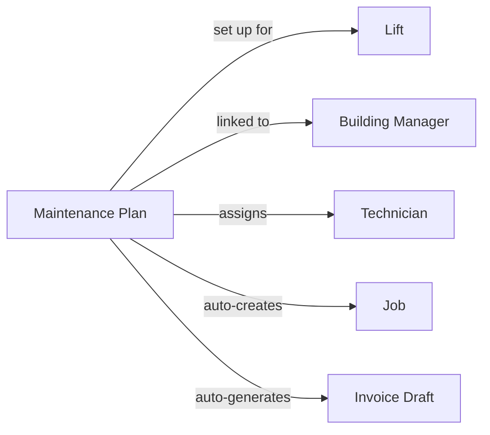

This page explains the key building blocks of LiftAuth and how they connect. Read this before anything else.

---

## Your Organisation

Your organisation works with **Building Managers** and maintains **Lifts**. A Building Manager is responsible for the building that a lift is installed in.

---

## What is a Job?

A job represents a single service visit to a lift. Every time a technician goes on-site, a job must exist for that visit.

There are three types of jobs:

| Type | When to use |
| --- | --- |
| **Maintenance** | A planned, routine inspection — monthly, quarterly, etc. |
| **Breakdown** | An emergency call-out when the lift has stopped working or is unsafe. |
| **Repair** | A visit to fix a specific, previously reported fault. |

---

## How is a Job created?

Jobs can be created in two ways:

- **Manually** — an Admin creates a job from the dashboard, assigns it to a technician, and sets a date and time.
- **Automatically** — if a lift has a [Maintenance Plan](/start/concepts#maintenance-plans), jobs are created on a recurring schedule without any manual input.

---

## The Job lifecycle

Every job moves through the following stages:

<Steps>
  <Step title="Open">
    The job exists but has not been scheduled or assigned yet.
  </Step>
  <Step title="Scheduled">
    A technician and a date/time window have been assigned. The technician can see it in their mobile app.
  </Step>
  <Step title="Work Done">
    The technician has completed the on-site work and submitted their checklist or report. A record is automatically created. The Building Manager receives a signing request by email and SMS.
  </Step>
  <Step title="Signed">
    The Building Manager has signed the [Record](/start/concepts#records). The job is ready to be reviewed and closed by an Admin.
  </Step>
  <Step title="Closed">
    The Admin has reviewed and closed the job. If a [Maintenance Plan](/start/concepts#maintenance-plans) is active, an invoice draft is generated automatically.
  </Step>
</Steps>

---

## Records {#records}

A record is the written report of what happened during a job. It is created automatically when the technician submits their work. It contains:

- The checklist results (pass/fail for each item)
- Any notes the technician added
- Photos attached on-site
- The technician's signature
- The Building Manager's signature

Records are permanent — they cannot be edited after signing.

---

## Issues

Issues are faults found on a lift. They can be reported by a technician during a job, or logged by an Admin. A repair job can be raised to address an issue. When the technician marks it as fixed, the issue is automatically closed.

A Repair job can be linked to one or more issues. When the technician marks an issue as fixed, it is automatically closed.

---

## Invoices

Invoices are sent to the Building Manager after work is completed. If a [Maintenance Plan](/start/concepts#maintenance-plans) is active, an invoice draft is generated automatically at the end of each cycle. An Admin must approve the draft before it becomes a real invoice.

---

## Maintenance Plans {#maintenance-plans}

A Maintenance Plan ties everything together. Once set up, it automatically creates jobs on a recurring schedule and generates invoice drafts at the end of each cycle — without any manual input from an Admin.

