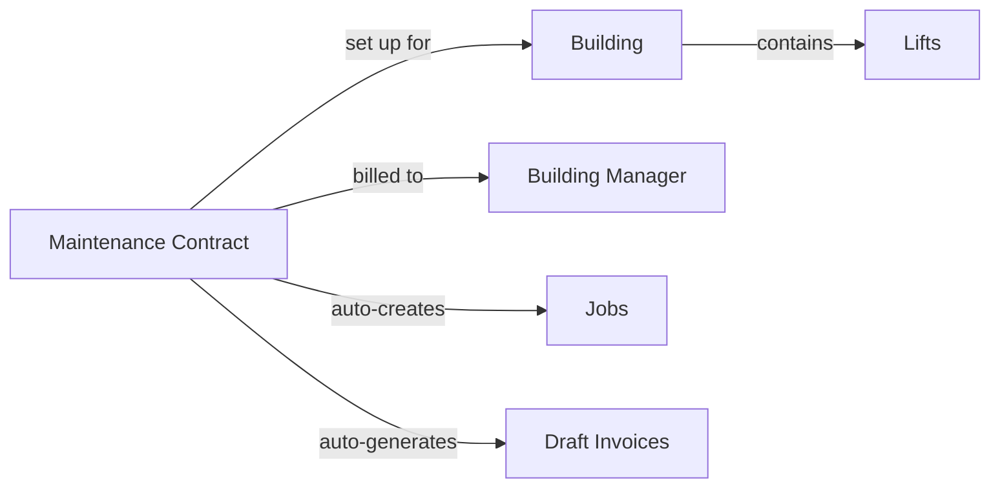

This page explains the key building blocks of LiftAuth and how they connect. Read this before anything else.

---

## Your organisation

Your organisation works with **Building Managers** and maintains **Lifts**. A Building Manager is responsible for the building a lift is installed in. Some screens call them the customer — it means the same thing.

---

## What is a Job?

A job is one visit's worth of work at one building. Every time a technician goes on site, a job must exist for that visit.

A job holds the building, the lifts being worked on, the forms the technician fills in, and one assignee — a technician or a team.

The job itself has no type. The kind of work is decided by the **form** attached to it, which comes from one of your record templates:

| Kind of visit | When |
| --- | --- |
| **Maintenance** | A planned, routine inspection — monthly, quarterly, and so on. |
| **Breakdown** | An emergency call-out when a lift has stopped working or is unsafe. |
| **Repair** | A visit to fix a specific, previously reported fault. |

<Note>
  Jobs used to be one lift with one fixed type. They are now a building plus whichever lifts and forms that visit needs. See [What is a Job](/what-is-a-job) for the detail.
</Note>

---

## How is a Job created?

- **Manually** — an admin schedules a job from the dashboard, choosing the building, the lifts, the forms, and who does it.
- **Automatically** — a building with a [maintenance contract](/admin/maintenance-contracts/overview) gets its visits created on a recurring schedule with no manual input.
- **On site** — a technician can create a job for an unplanned visit from the app.

---

## The Job lifecycle

<Steps>
  <Step title="Open">
    The job exists but has not been scheduled or assigned yet.
  </Step>
  <Step title="Scheduled">
    A technician or team and a date/time window have been assigned. It appears in the technician's mobile app.
  </Step>
  <Step title="Work Done">
    The technician has completed the on-site work and submitted it. A record is created automatically, waiting for sign-off.
  </Step>
  <Step title="Signed">
    Sign-off is complete — either the Building Manager signed, or the technician skipped signing because nobody was available. The job is ready for an admin to review and close.
  </Step>
  <Step title="Closed">
    The admin has reviewed and closed the job. A draft invoice is raised only if the job belongs to an active contract billed per job, or came from a converted quote — contracts billed annually invoice on their own schedule instead.
  </Step>
</Steps>

A job can also be **Cancelled** at any point before it closes. Closed and Cancelled are both final.

---

## Records {#records}

A record is the written report of what happened during a job. It is created when the technician submits their work, and contains:

- the result of each item on the form (pass/fail, readings, notes)
- any notes the technician added
- photos attached on site
- the technician's signature
- the Building Manager's signature, if one was given

Records are permanent — they cannot be edited after signing. Every record is filed automatically in [Drive](/admin/drive/overview) under the building it belongs to.

---

## How sign-off reaches the Building Manager

The Building Manager signs for themselves; nobody can sign on their behalf from the dashboard. There are three ways it happens:

- **On site** — they sign on the technician's phone before the technician leaves.
- **By link** — the technician generates a one-time signing link and shares it, so they can sign on their own device.
- **By email** — an owner or admin sends the request from the record in Drive. It goes to everyone the building manager's own firm has assigned to that building.

Every link is a single-use token that expires after 7 days, and generating a new one does **not** cancel the earlier ones. Whoever opens the link can sign without a LiftAuth account — an account is only needed to _receive_ the email.

If neither is possible, the technician can **skip signing**. The job still reaches Signed, but the PDF carries no Building Manager signature.

---

## Issues

Issues are faults found on a lift. A technician can report one during a job, or an admin can log one. A repair job can be raised to address one or more issues, and when the technician marks an issue as fixed it closes automatically.

---

## Money

Work becomes money in three steps, all of which live in [Billing](/admin/billing/overview):

- A **quote** prices work before you do it.
- An **invoice** bills for work done. Contracts generate draft invoices each cycle; you can also write one by hand or raise one from a project.
- A **payment** records money received against an invoice.

A draft invoice is not yet real. An admin must **issue** it to finalise it and give it its reference number. Issuing is a separate act from emailing it to the customer.

---

## Maintenance Contracts {#maintenance-contracts}

A maintenance contract ties everything together. Set one up for a building and LiftAuth creates the visits on a recurring schedule and generates draft invoices each cycle, with no manual input.

Contracts are set per **building**, and cover the lifts in it. Older guidance called this a "maintenance plan".

```mermaid
flowchart LR
    Plan["Maintenance Contract"]
    Plan -->|set up for| Building["Building"]
    Building -->|contains| Lift["Lifts"]
    Plan -->|billed to| BM["Building Manager"]
    Plan -->|auto-creates| Job["Jobs"]
    Plan -->|auto-generates| Draft["Draft Invoices"]
```
