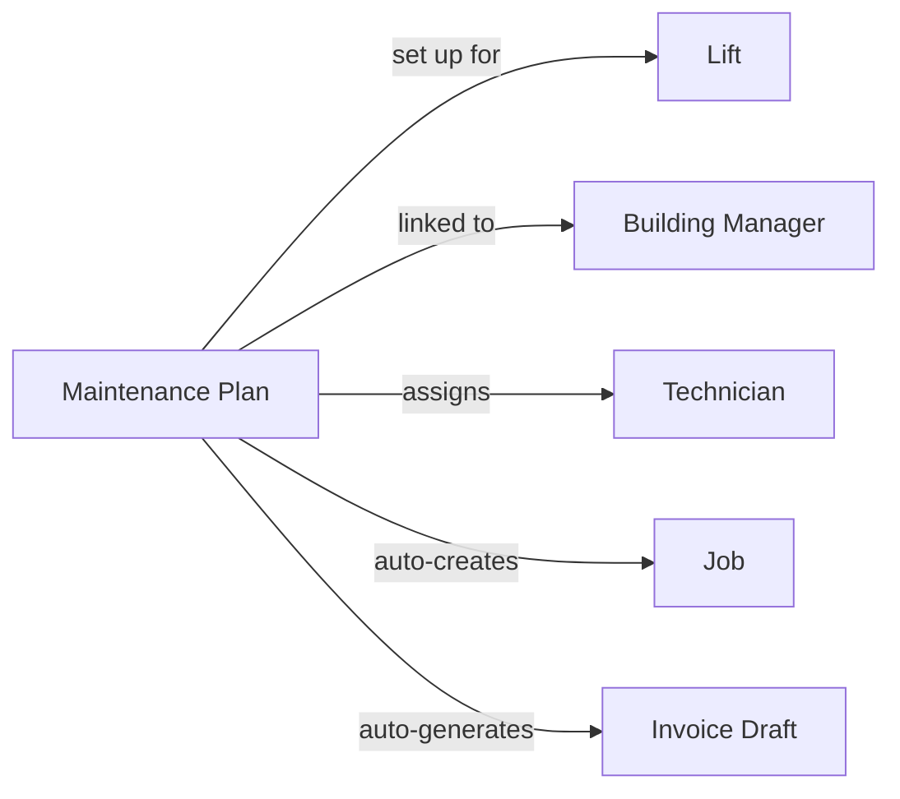

此页面解释了 LiftAuth 的关键构建块以及它们之间的连接方式。请在阅读其他内容之前先阅读此页面。

---

## 您的组织

您的组织与**建筑经理**合作并维护**电梯**。建筑经理负责安装电梯的建筑。

---

## 什么是工作?

工作代表对电梯的单次服务访问。每当技术员到现场时,该访问必须存在一项工作。

工作有三种类型:

| 类型 | 何时使用 |
| --- | --- |
| **Maintenance** | 计划的、例行的检查 — 每月、每季度等。 |
| **Breakdown** | 当电梯停止工作或不安全时的紧急呼叫。 |
| **Repair** | 访问以修复先前报告的特定故障。 |

---

## 如何创建工作?

工作可以通过两种方式创建:

- **手动** — 管理员从仪表板创建工作,将其分配给技术员,并设置日期和时间。
- **自动** — 如果电梯有[维护计划](/start/concepts#maintenance-plans),工作将按定期计划创建,无需任何手动输入。

---

## 工作生命周期

每项工作都经历以下阶段:

<Steps>
  <Step title="Open">
    工作存在但尚未安排或分配。
  </Step>
  <Step title="Scheduled">
    已分配技术员和日期/时间窗口。技术员可以在他们的移动应用程序中看到它。
  </Step>
  <Step title="Work Done">
    技术员已完成现场工作并提交了检查表或报告。记录会自动创建。建筑经理通过电子邮件和短信收到签字请求。
  </Step>
  <Step title="Signed">
    建筑经理已在[记录](/start/concepts#records)上签字。工作已准备好由管理员审核和关闭。
  </Step>
  <Step title="Closed">
    管理员已审核并关闭工作。如果[维护计划](/start/concepts#maintenance-plans)处于活动状态,则会自动生成发票草稿。
  </Step>
</Steps>

---

## 记录 {#records}

记录是工作期间发生的事情的书面报告。当技术员提交工作时,它会自动创建。它包含:

- 检查表结果(每项的通过/失败)
- 技术员添加的任何备注
- 现场附加的照片
- 技术员的签名
- 建筑经理的签名

记录是永久的 — 签字后无法编辑。

---

## 问题

问题是电梯上发现的故障。它们可以由技术员在工作期间报告,或由管理员记录。可以提出维修工作来解决问题。当技术员将其标记为已修复时,问题会自动关闭。

维修工作可以链接到一个或多个问题。当技术员将问题标记为已修复时,它会自动关闭。

---

## 发票

发票在工作完成后发送给建筑经理。如果[维护计划](/start/concepts#maintenance-plans)处于活动状态,则在每个周期结束时会自动生成发票草稿。管理员必须批准草稿才能使其成为真正的发票。

---

## 维护计划 {#maintenance-plans}

维护计划将一切联系在一起。一旦设置好,它会自动按定期计划创建工作并在每个周期结束时生成发票草稿 — 无需管理员任何手动输入。

