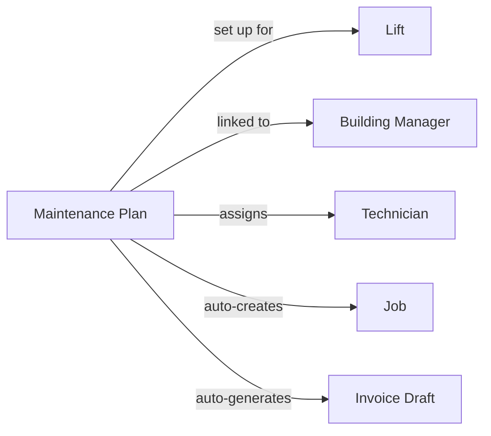

本页面介绍 LiftAuth 的关键构建块以及它们如何相互连接。在阅读其他内容之前请先阅读本页。

---

## 您的组织

您的组织与 **Building Managers** 合作并维护 **Lifts**。Building Manager 负责安装电梯的建筑。

---

## 什么是工单?

工单代表对一部电梯的一次服务访问。每当技术员前往现场时,该次访问都必须存在一个工单。

工单分为三种类型:

| 类型 | 何时使用 |
| --- | --- |
| **Maintenance** | 计划内的常规检查 — 每月、每季度等。 |
| **Breakdown** | 当电梯停止工作或不安全时的紧急出动。 |
| **Repair** | 用于修复先前报告的特定故障的访问。 |

---

## 工单是如何创建的?

工单可以通过两种方式创建:

- **手动** — Admin 从仪表板创建工单,将其分配给技术员,并设置日期和时间。
- **自动** — 如果一部电梯有 [Maintenance Plan](/zh-Hans/start/concepts#maintenance-plans),则会按重复计划创建工单,无需任何手动输入。

---

## 工单生命周期

每个工单都会经过以下阶段:

<Steps>
  <Step title="Open">
    工单已存在,但尚未安排或分配。
  </Step>
  <Step title="Scheduled">
    已分配技术员和日期/时间窗口。技术员可以在其移动应用中看到它。
  </Step>
  <Step title="Work Done">
    技术员已完成现场工作并提交了检查清单或报告。系统会自动创建一条记录。Building Manager 通过电子邮件和短信收到签字请求。
  </Step>
  <Step title="Signed">
    Building Manager 已对 [Record](/zh-Hans/start/concepts#records) 签字。工单已准备好由 Admin 审核并关闭。
  </Step>
  <Step title="Closed">
    Admin 已审核并关闭工单。如果 [Maintenance Plan](/zh-Hans/start/concepts#maintenance-plans) 处于活动状态,则会自动生成发票草稿。
  </Step>
</Steps>

---

## Records {#records}

record 是工单期间所发生事项的书面报告。它会在技术员提交工作时自动创建。它包含:

- 检查清单结果(每项的通过/失败)
- 技术员添加的任何备注
- 现场附加的照片
- 技术员的签名
- Building Manager 的签名

Records 是永久性的 — 签字后无法编辑。

---

## Issues

Issues 是在电梯上发现的故障。它们可以由技术员在工单期间报告,也可以由 Admin 记录。可以发起一个 repair 工单来处理一个 issue。当技术员将其标记为已修复时,issue 会自动关闭。

一个 Repair 工单可以关联到一个或多个 issues。当技术员将一个 issue 标记为已修复时,它会自动关闭。

---

## Invoices

工作完成后,Invoices 会发送给 Building Manager。如果 [Maintenance Plan](/zh-Hans/start/concepts#maintenance-plans) 处于活动状态,在每个周期结束时会自动生成发票草稿。Admin 必须先批准草稿,它才会成为真正的发票。

---

## Maintenance Plans {#maintenance-plans}

Maintenance Plan 将一切串联起来。设置好后,它会按重复计划自动创建工单,并在每个周期结束时生成发票草稿 — 无需 Admin 的任何手动输入。

