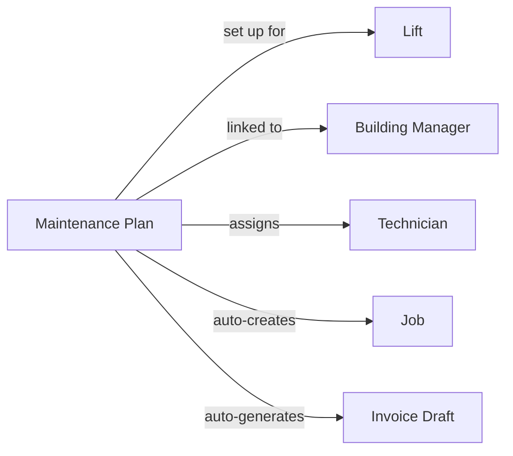

本页面解释了 LiftAuth 的关键组成部分以及它们如何相互连接。请先阅读此页面。

---

## 您的组织

您的组织与 **Building Managers** 合作并维护 **Lifts**。Building Manager 负责安装电梯的建筑。

---

## 什么是任务?

一项任务代表对电梯的一次服务访问。每当技术员前往现场时,都必须为该访问创建一个任务。

任务分为三种类型:

| 类型 | 何时使用 |
| --- | --- |
| **Maintenance** | 计划的例行检查——每月、每季度等。 |
| **Breakdown** | 当电梯停止工作或不安全时的紧急呼叫。 |
| **Repair** | 修复先前报告的特定故障的访问。 |

---

## 任务是如何创建的?

任务可以通过两种方式创建:

- **手动** — Admin 在控制台中创建任务、分配给技术员,并设置日期和时间。
- **自动** — 如果电梯有 [Maintenance Plan](/start/concepts#maintenance-plans),则会按重复计划自动创建任务,无需任何手动输入。

---

## 任务生命周期

每个任务都会经历以下阶段:

<Steps>
  <Step title="Open">
    任务已存在,但尚未安排或分配。
  </Step>
  <Step title="Scheduled">
    已分配技术员和日期/时间窗口。技术员可以在移动应用中看到它。
  </Step>
  <Step title="Work Done">
    技术员已完成现场工作并提交了检查清单或报告。记录会自动创建。Building Manager 通过电子邮件和短信收到签署请求。
  </Step>
  <Step title="Signed">
    Building Manager 已在 [Record](/start/concepts#records) 上签字。任务现已准备好由 Admin 审核并关闭。
  </Step>
  <Step title="Closed">
    Admin 已审核并关闭任务。如果 [Maintenance Plan](/start/concepts#maintenance-plans) 处于活动状态,则会自动生成发票草稿。
  </Step>
</Steps>

---

## Records {#records}

记录是关于任务期间发生的事情的书面报告。当技术员提交工作时会自动创建。它包含:

- 检查清单结果(每项的通过/失败)
- 技术员添加的任何注释
- 现场附加的照片
- 技术员的签名
- Building Manager 的签名

记录是永久性的——签字后无法编辑。

---

## Issues

Issues 是在电梯上发现的故障。它们可以由技术员在任务期间报告,或由 Admin 记录。可以发起 repair 任务来解决 issue。当技术员将其标记为已修复时,issue 会自动关闭。

一个 Repair 任务可以链接到一个或多个 issue。当技术员将 issue 标记为已修复时,它会自动关闭。

---

## Invoices

工作完成后,发票会发送给 Building Manager。如果 [Maintenance Plan](/start/concepts#maintenance-plans) 处于活动状态,则会在每个周期结束时自动生成发票草稿。Admin 必须批准草稿,使其成为正式发票。

---

## Maintenance Plans {#maintenance-plans}

Maintenance Plan 将所有内容连接在一起。一旦设置完成,它会按重复计划自动创建任务,并在每个周期结束时生成发票草稿——无需 Admin 任何手动输入。

