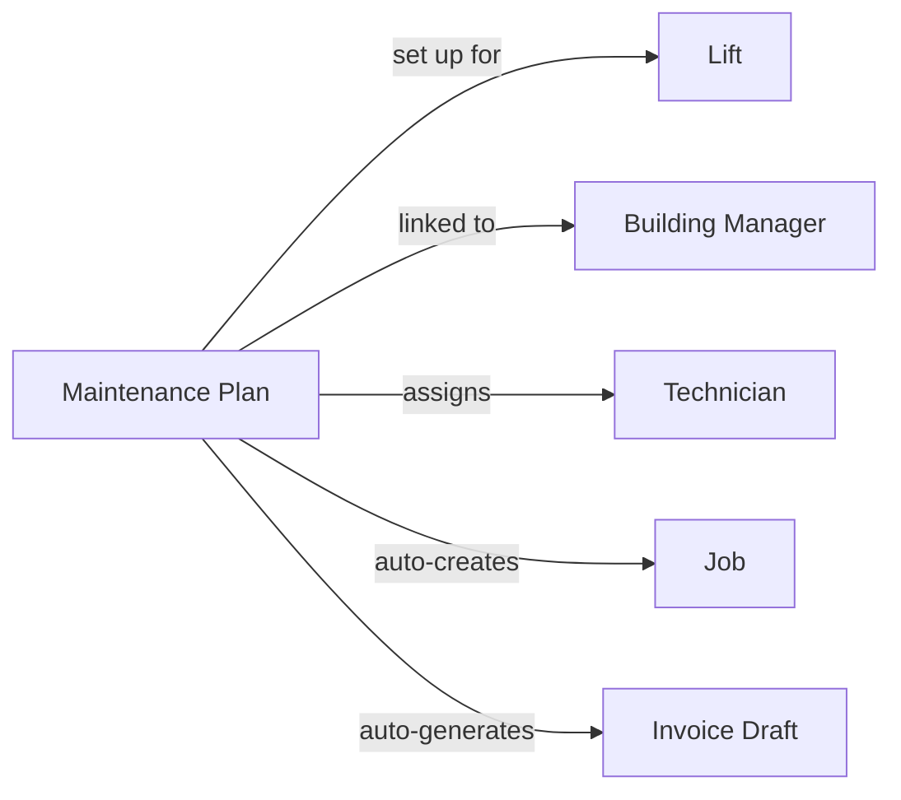

本页解释 LiftAuth 的关键构成元素以及它们之间的关联。请在阅读其他内容之前先阅读本页。

---

## 您的组织

您的组织与 **Building Managers** 合作并维护 **Lifts**。Building Manager 负责安装电梯所在的楼宇。

---

## 什么是工单?

工单代表一次对电梯的服务访问。每当技术员前往现场,该次访问都必须有一个工单。

工单有三种类型:

| 类型 | 何时使用 |
| --- | --- |
| **Maintenance** | 有计划的例行检查——每月、每季度等。 |
| **Breakdown** | 当电梯停止工作或不安全时的紧急出勤。 |
| **Repair** | 为修复特定的、先前已报告故障的访问。 |

---

## 工单如何创建?

工单可以通过两种方式创建:

- **Manually** — Admin 从控制台创建工单,分配给技术员,并设置日期和时间。
- **Automatically** — 如果电梯有 [Maintenance Plan](/start/concepts#maintenance-plans),工单将按重复周期自动创建,无需任何手动输入。

---

## 工单生命周期

每个工单都经历以下阶段:

<Steps>
  <Step title="Open">
    工单已存在,但尚未安排或分配。
  </Step>
  <Step title="Scheduled">
    已分配技术员和日期/时间窗口。技术员可以在其移动应用中看到它。
  </Step>
  <Step title="Work Done">
    技术员已完成现场工作并提交了检查清单或报告。系统自动创建记录。Building Manager 通过电子邮件和短信收到签字请求。
  </Step>
  <Step title="Signed">
    Building Manager 已对 [Record](/start/concepts#records) 签字。工单已准备好供 Admin 审核并关闭。
  </Step>
  <Step title="Closed">
    Admin 已审核并关闭工单。如果 [Maintenance Plan](/start/concepts#maintenance-plans) 处于活动状态,系统将自动生成发票草稿。
  </Step>
</Steps>

---

## Records {#records}

记录是关于工单期间发生的事情的书面报告。当技术员提交其工作时会自动创建。它包含:

- 检查清单结果(每项的通过/失败)
- 技术员添加的任何备注
- 在现场附加的照片
- 技术员的签名
- Building Manager 的签名

记录是永久的——签字后无法编辑。

---

## Issues

Issues 是在电梯上发现的故障。它们可以由技术员在工单期间报告,或由 Admin 记录。可以创建 repair 工单来解决 issue。当技术员将其标记为已修复时,issue 会自动关闭。

一个 Repair 工单可以关联到一个或多个 issues。当技术员将某个 issue 标记为已修复时,它将自动关闭。

---

## Invoices

工作完成后,发票将发送给 Building Manager。如果 [Maintenance Plan](/start/concepts#maintenance-plans) 处于活动状态,则在每个周期结束时自动生成发票草稿。Admin 必须在草稿成为正式发票之前批准它。

---

## Maintenance Plans {#maintenance-plans}

Maintenance Plan 将所有内容联系在一起。一旦设置完成,它会按重复周期自动创建工单,并在每个周期结束时生成发票草稿——无需 Admin 任何手动输入。

